# Herramienta de Registro de Transporte para Asambleas Especiales, Chile 2024

## Objetivo

El propósito de esta herramienta es proporcionar un mecanismo para registrar los delegados a ser transportados durante las Asambleas Especiales Chile 2024. Está dirigida exclusivamente a los voluntarios que trabajarán como capitanes de buses o sus ayudantes.

[Aplicación](https://d2zasmofz30od8.cloudfront.net/)

-   email: voluntario@transporte.cl

-   contraseña: Clave123!

# Casos de uso

## Ingreso

-   El voluntario se autentica a través del formulario de acceso:

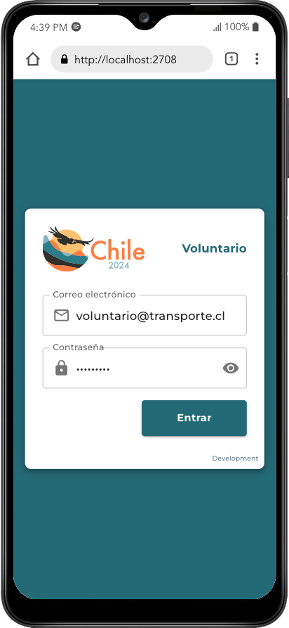

-   Se muestran la(s) asignación(es) que tiene el voluntario para ese día:

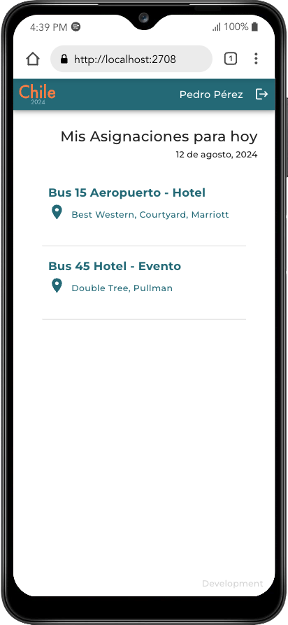

## Control

-   A través de la vista de control podrá registrar los delegados (y opcionalmente verificar la cantidad de sus respectivos equipajes), que vayan presentándose para abordar el transporte previamente asignado. Es posible Buscar/Filtrar entre el listado de delegados utilizando su nombre, código o alojamiento.

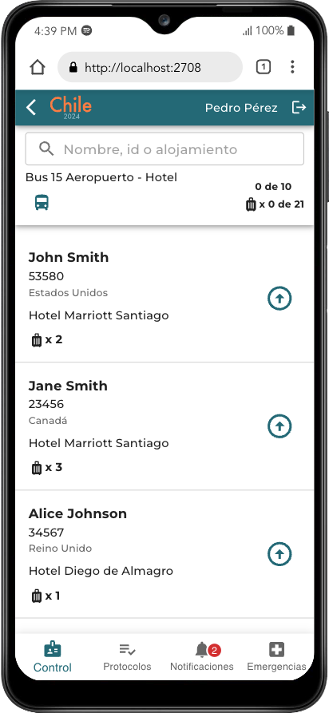
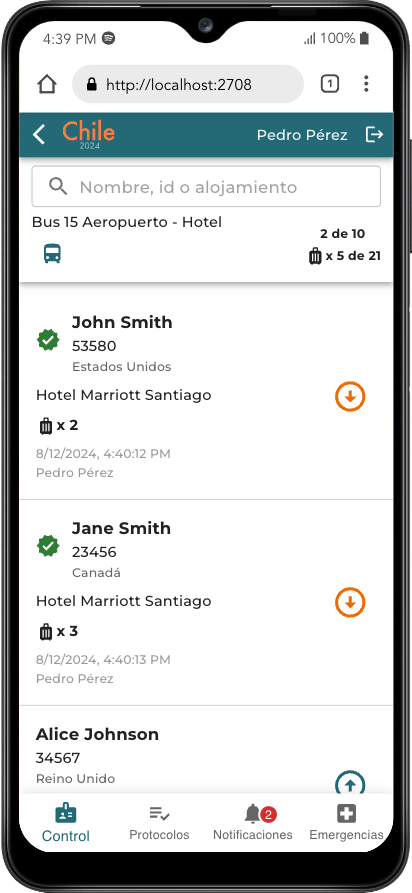

-   Una vez ubicado el nombre del delegado se puede presionar el botón verde con la fecha hacia arriba para indicar que abordó la unidad de transporte y que la cantidad de piezas de su equipaje fueron verificadas. Esto permitirá saber fácilmente el total de delegados y de piezas de equipaje que se han registrado.

Una vez completada la verificación de los delegados, el botón superior con ícono de Bus verde permite iniciar el viaje. A partir de este momento solo resta completar el viaje y registrar la llegada utilizando el mismo botón que ahora es un Bus naranjo.

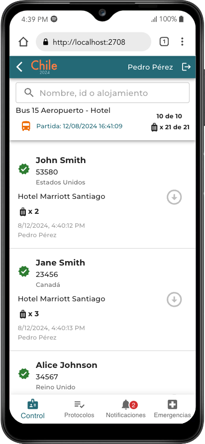
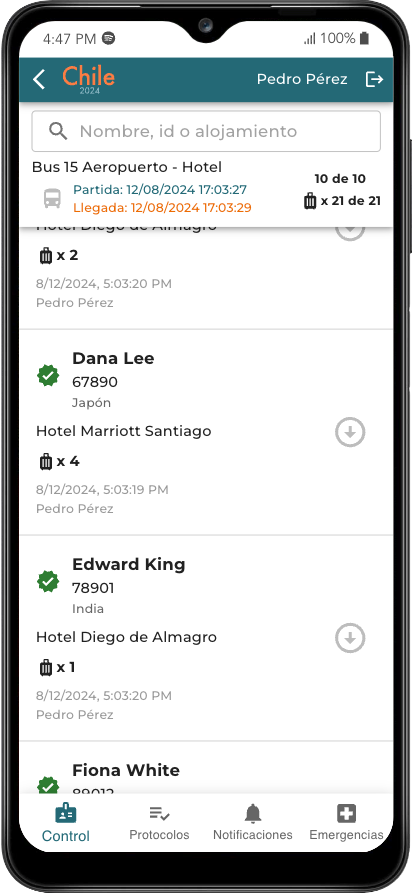

-   En el menú inferior puede seleccionarse la opción _Protocolos_ para consultar los procedimientos asociados a la asignación. Allí estará publicada información importante relacionada con la asignación, y será visible a todos los voluntarios asociados a la misma.

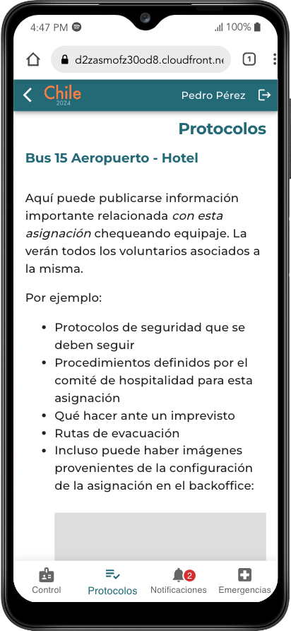

-   La sección de notificaciones es una forma sencilla de enviar alertas a todos los voluntarios asignados a este punto de control. Pueden ser mensajes de último momento, recordatorios, actualizaciones, etc.

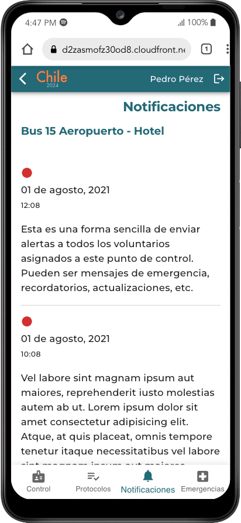

-   La sección de Emergencia permite al voluntario consultar información sobre hospitales, clínicas, farmacias, etc. cercanos a la ubicación del punto de control.

En caso de surgir una emergencia con un delegado, también podrá reportar detalles de la misma utilizando el código del delegado y registrando un mensaje al comité de hospitalidad

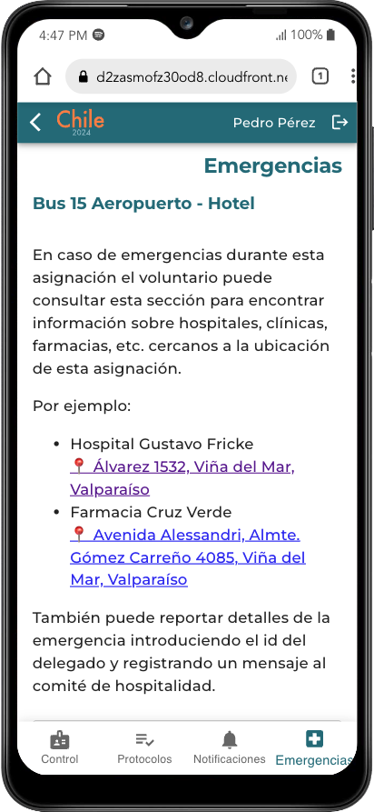
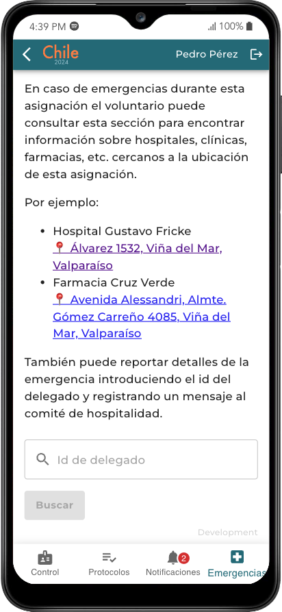
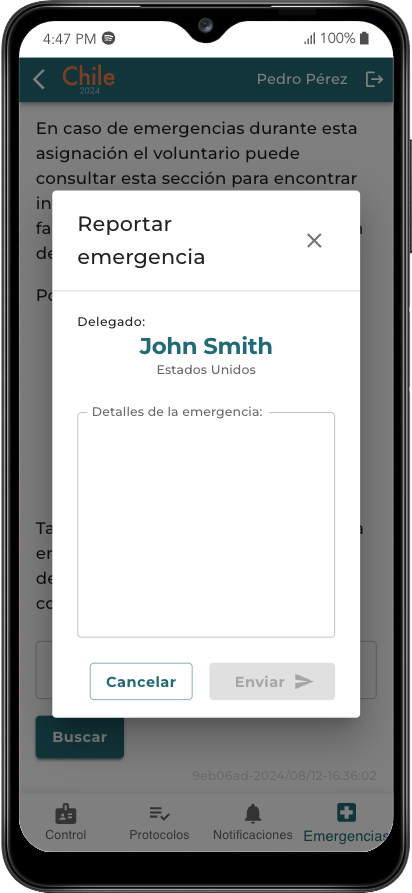

# Consideraciones técnicas

### Tipos

```typescript
// id: identificador único para el viaje. Será utilizado en otras operaciones. Se recomienda que sea un guid
// nombre: es el nombre visible del viaje
// description: descripción visible del viaje
// showLuggage: opcional. booleano. Indica si en el proceso de registro el voluntario debería visualizar información de equipaje (cantidad)
// departureTime: opcional. Fecha y hora en que es registrada la partida del transporte
// arrivalTime: opcional. Fecha y hora en que es registrada la llegada del transporte
interface ITrip {
    id: string;
    name: string;
    description: string;
    showLuggage?: boolean;
    departureTime?: string;
    arrivalTime?: string;
    delegates: IDelegate[];
}

// id: identificador único para la notificación. Se recomienda que sea un guid
// created_at: Fecha/hora en que se creó la notificación en el backoffice
// subject: títulod de la notificación
// message: cuerpo de la notificación
interface INotification {
    id: string;
    dateTime: string;
    subject: string;
    message: string;
}

// tripId: identificador único del viaje al que pertenece el listado de notificaciones. Se recomienda que sea un guid
// tripName: nombre visible del viaje al que pertenece el listado de notificaciones
// notifications: array de notificaciones
interface INotificationsList {
    tripId: string;
    tripName: string;
    notifications: INotification[];
}

// id: identificador único para el delegado
// nombre: nombre completo del delegado
// countryCode: Código de dos caracteres del país de procedencia
// accommodation: Nombre del hotel en donde aloja el delegado
// checkedBy: opcional. Nombre del voluntario que registró el embarque del delegado
// checkedAt: opcional. Fecha y hora en la que se registró el embarque del delegado
// luggageCount: Opcional. Cantidad de piezas de equipaje del delegado
interface IDelegate {
    id: string;
    name: string;
    countryCode: string;
    accommodation: string;
    checkedBy?: string;
    checkedAt?: string;
    luggageCount?: number;
}

// tripId: identificador único del viaje. Se recomienda que sea un guid
// tripName: nombre visible del viaje
// text: contenido a mostrar
interface IEmergencyInfo {
    tripId: string;
    tripName: string;
    text: string;
}

// tripId: identificador único del viaje. Se recomienda que sea un guid
// tripName: nombre visible del viaje
// text: contenido a mostrar
interface IProtocol {
    tripId: string;
    tripName: string;
    text: string;
}
```

# Endpoints REST

## Autenticación

#### POST /auth/login

-   **Payload:**
    ```json
    {
        "email": "string",
        "password": "string"
    }
    ```
-   **Response:**
    ```json
    {
        "token": "string",
        "role": "string",
        "volunteer_profile": {
            "name": "string"
        }
    }
    ```
    -   **Ejemplo:**
    ```json
    {
        "token": "eyJhbGciOiJIUzI1NiIsInR5cCI6IkpXVCJ9...",
        "role": "operator",
        "volunteer_profile": {
            "name": "Pedro Pérez"
        }
    }
    ```

Todos los endpoints a continuación están restringidos a usuarios registrados y autenticados. El token de autenticación es enviado en el header de cada request.

## Viaje

### GET `/trips`

Retorna los viajes en los que el voluntario ha sido asignado en la fecha actual.

-   **Response:** `ITrip[]`
-   **Ejemplo:**
    ```json
    [
        {
            "id": "5390efa3-c9e2-47e1-a74f-3a163021f71b",
            "name": "Bus 15 Aeropuerto - Hotel",
            "address": "Best Western, Courtyard, Marriott",
            "showLuggage": true,
            "departureTime": undefined
            "arrivalTime": undefined
            "delegates": []
        }
    ]
    ```

### GET `/trips/{tripId}`

Retorna la información del viaje `tripId`.

-   **Response:** `ITrip`
-   **Ejemplo:**

    ```json
    {
        "id": "5390efa3-c9e2-47e1-a74f-3a163021f71b",
        "name": "Bus 15 Aeropuerto - Hotel",
        "address": "Best Western, Courtyard, Marriott",
        "showLuggage": true,
        "departureTime": undefined
        "arrivalTime": undefined
        "delegates": [
            {
                "id": "53580",
                "name": "John Smith",
                "countryCode": "US",
                "accommodation": "Hotel Marriott Santiago",
                "luggageCount": 2,
                "checkedBy": "Juan Pérez",
                "checkedAt": "8/12/2024, 6:29:20 PM",
            },
            {
                "id": "23456",
                "name": "Jane Smith",
                "countryCode": "CA",
                "accommodation": "Hotel Marriott Santiago",
                "luggageCount": 3
            },
            ...
        ]
    }
    ```

### `GET /trips/{tripId}/delegate/{delegateId}`

Retorna la información del delegado `delegateId` con respecto al viaje `tripId`

-   **Response:** `IDelegate`
-   **Ejemplo:**

    ```json
    {
        "id": "53580",
        "name": "John Smith",
        "countryCode": "US",
        "accommodation": "Hotel Marriott Santiago",
        "luggageCount": 2,
        "checkedBy": "Juan Pérez",
        "checkedAt": "8/12/2024, 6:29:20 PM",
    },
    ```

## Registro de delegado en viaje

### POST `/trips/{tripId}/delegate/{delegateId}/check_in`

Agrega al registro que el delegado `delegateId` fue chequeado en el viaje `tripId`, registrando el voluntario que lo chequeó y la fecha/hora en que ocurrió. Retorna `true` si fue exitoso.

-   **Response:** `boolean`

### POST `/trips/{tripId}/delegate/{delegateId}/check_out`

Remueve el registro del delegado `delegateId` en el viaje `tripId`, eliminando el voluntario que previamente lo chequeó y la fecha/hora. Retorna `true` si fue exitoso.

-   **Response:** `boolean`

## Registro de estado del viaje

### POST `/trips/{tripId}/departure`

Registra que el viaje `tripId` ha partido desde su origen, registrando el voluntario que lo chequeó y la fecha/hora en que ocurrió (`departureTime`). Retorna `true` si fue exitoso.

-   **Response:** `boolean`

### POST `/trips/{tripId}/arrival`

Registra que el viaje `id` ha llegado a su destino, registrando el voluntario que lo chequeó y la fecha/hora en que ocurrió (`arrivalTime`). Retorna `true` si fue exitoso.

-   **Response:** `boolean`

## Otros

### `GET /trips/{tripId}/protocols`

Retorna el texto que se mostrará en la sección de protocolos, asociado al viaje `tripId`. Puede ser texto enriquecido que se mostrará apropiadamente en la aplicación.

-   **Response ejemplo:**

    ```json
    {
        "tripId": "e1bcfd24-08fd-4e57-bbd5-e51c4c1fac64",
        "tripName": "Bus 15 Aeropuerto - Hotel",
        "text": "Aquí puede publicarse información importante relacionada <i style=\"font-weight: 600;\">con esta asignación</i> chequeando equipaje. La verán todos los voluntarios asociados a la misma.\n    <p>Por ejemplo:</p>\n    <ul>\n        <li>Protocolos de seguridad que se deben seguir </li>\n        <li>Procedimientos definidos por el comité de hospitalidad para esta asignación</li>\n        <li>Qué hacer ante un imprevisto</li>\n        <li>Rutas de evacuación</li>\n        <li>\n            Incluso puede haber imágenes provenientes de la configuración de la asignación en el backoffice:\n            <br />\n            <br />\n            <div>\n                \n            </div>\n        </li>\n    </ul>"
    }
    ```

### `GET /trips/{id}/emergency_info`

Retorna el texto que se mostrará en la sección de emergencias asociadas al viaje `tripId`. Puede ser texto enriquecido que se mostrará apropiadamente en la aplicación.

-   **Response ejemplo:**

    ```json
    {
        "tripId": "e1bcfd24-08fd-4e57-bbd5-e51c4c1fac64",
        "tripName": "Bus 15 Aeropuerto - Hotel",
        "text": "<p>\n        En caso de emergencias durante esta asignación el voluntario puede consultar esta sección para encontrar información sobre hospitales, clínicas, farmacias, etc. cercanos a la ubicación\n        de esta asignación.\n    </p>\n    <p>Por ejemplo:</p>\n    <ul>\n        <li>\n            <div>Hospital Gustavo Fricke</div>\n            <a href='https://maps.google.com/?q=-33.02877500992159,%20-71.54304099594539'>📍 Álvarez 1532, Viña del Mar, Valparaíso</a>\n        </li>\n        <li>\n            <div>Farmacia Cruz Verde</div>\n            <a href='https://maps.google.com/?q=-32.99438845000991,-71.51027942681407'>📍 Avenida Alessandri, Almte. Gómez Carreño 4085, Viña del Mar, Valparaíso</a>\n        </li>\n    </ul>\n    <p>También puede reportar detalles de la emergencia introduciendo el id del delegado y registrando un mensaje al comité de hospitalidad.</p>"
    }
    ```

### `GET /trips/{tripId}/notifications`

Retorna un `INotificationsList` con todas las notificaciones asociadas al viaje `tripId`. La app se encargará de consultar este endpoint con cierta frecuencia y destacar las notificaciones más recientes.

-   **Response:** `INotificationsList`
-   **Ejemplo:**
    ```json
    {
        "tripId": "e1bcfd24-08fd-4e57-bbd5-e51c4c1fac64",
        "tripName": "Bus 15 Aeropuerto - Hotel",
        "notifications": [
            {
                "id": "fbc5f630-2388-46ee-b7cb-e00236a6e22f",
                "created_at": "2024-07-21T10:00:00Z",
                "subject": "Consideración importante",
                "message": "Sit amet diam diam lorem et sanctus sea dolor erat stet, sit voluptua gubergren dolores ipsum voluptua et aliquyam nonumy."
            }
        ]
    }
    ```

## Registrar emergencias en un viaje

Registra la eventualidad de un caso de emergencia asociado al delegado `delegateId` en el viaje `tripId`. `message` es un texto con las observaciones del voluntario que realiza el reporte

### POST `/trips/{tripId}/report_emergency`

-   **Payload:**
    ```json
    {
        "delegateId": "string",
        "message": "string"
    }
    ```
-   **Response:** `boolean`
