# Herramienta de Registro para Asambleas Especiales Chile 2024

## Objetivo

El propósito de esta herramienta es proporcionar un mecanismo intuitivo, rápido y eficiente para registrar la ubicación de los delegados durante las Asambleas Especiales Chile 2024. Está dirigida exclusivamente a los voluntarios asignados a los puntos de control.

## Definición de Punto de Control

Un punto de control es cualquier lugar donde sea necesario registrar la presencia de los delegados y/o sus equipajes.

## Tecnología Utilizada

Se emplea la tecnología de generación y lectura de códigos QR, los cuales serán adheridos a la identificación visible de los delegados y a cada pieza de equipaje.

Para la generación masiva de códigos QR, puede acceder a [este generador de códigos QR](https://d2zasmofz30od8.cloudfront.net/generator). Este generador permite crear e imprimir códigos QR aleatorios fácilmente, que se utilizarán en el proceso de seguimiento.

### Recomendaciones para el Uso de Códigos QR

-   **Delegados:** Se sugiere imprimir los códigos QR en papel autoadhesivo para facilitar su colocación en las identificaciones visibles de los delegados.


-   **Equipajes:** Se recomienda utilizar tags similares a los empleados en los aeropuertos para adherir los códigos QR a los equipajes.


# Casos de uso

## Ingreso

-   El voluntario se autentica a través del formulario de acceso:

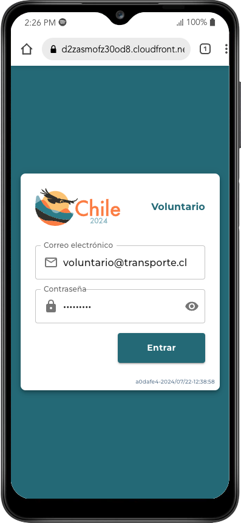

-   Se muestran la(s) asignacion(es) que tiene el voluntario para ese día:

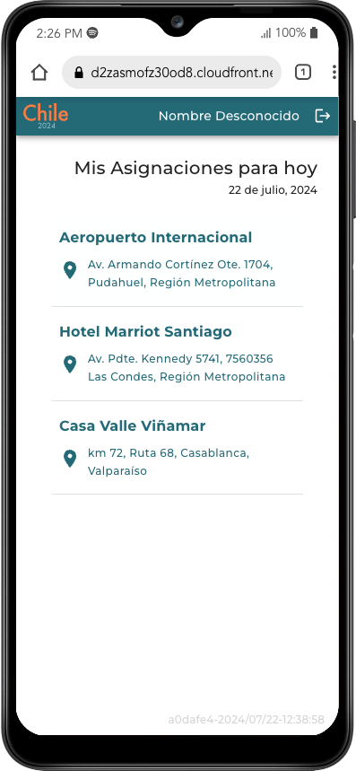

## Caso 1: Enrolamiento

-   Cuando el voluntario es asignado a un punto de control con enrolamiento, debe contar con los códigos QR preimpresos. A través de las siguientes vistas podrá vincular/enrolar los delegados (y sus respectivos equipajes), que vayan presentándose de acuerdo con el cronograma de aterrizajes preestablecidos. Es posible Buscar/Filtrar entre el listado de delegados que se esperan para ese día.

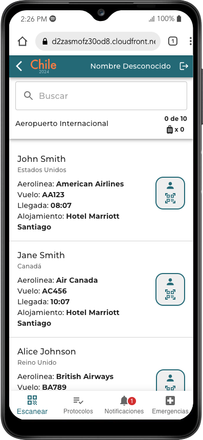

-   Una vez ubicado el nombre del delegado, coloca en su identificación visible un nuevo código QR. Una vez adherido procede a escanera el código con el botón de escanéo junto al nombre del delegado, el cual abrirá la cámara del dispositivo:

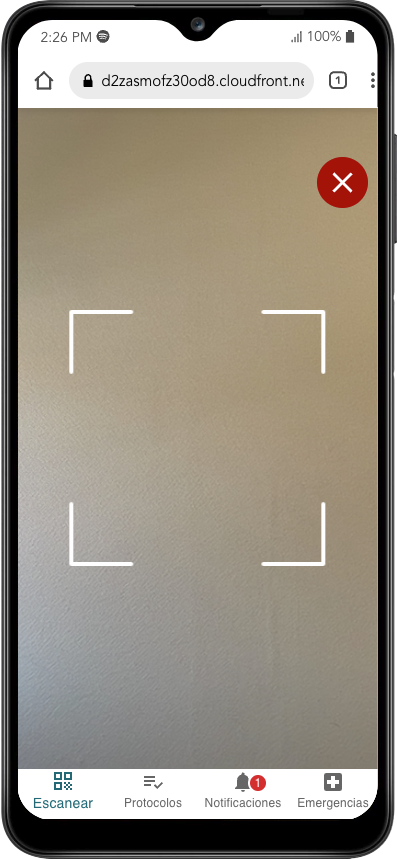

-   Al completarse el escaneo se muestra la verificación correspondiente junto al nombre del delegado. En este momento el mismo botón le permitirá proceder a escanear los códigos QR colocados en cada pieza de equipaje. Para evitar confusiones, siempre será preferible instalar el QR _antes_ de proceder a escanearlo

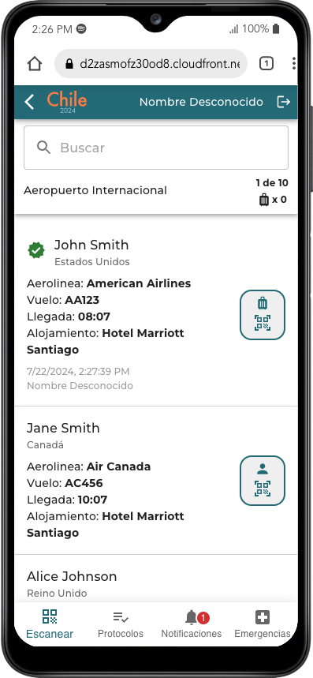

-   Al registrar el equipaje, se mostrará la cantidad correspondiente en la sección perteneciente al delegado, y a su vez un total en la parte superior de la aplicación. Esto permitirá saber fácilmente el total de delegados y de piezas de equipaje que se han registrado.

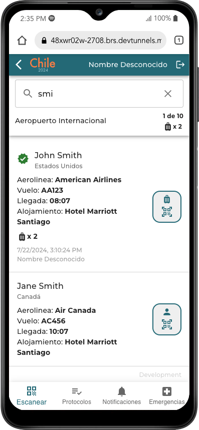

-   En el menú inferior puede seleccionarse la opción _Protocolos_ para consultar los procedimientos asociados a la asignación. Allí estará publicada información importante relacionada con _el punto de control_, y será visible a todos los voluntarios asociados a la misma.

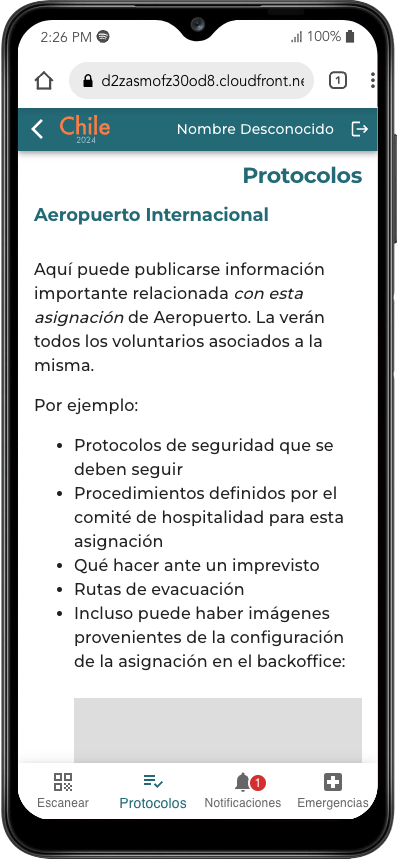

-   La sección de notificaciones es una forma sencilla de enviar alertas a todos los voluntarios asignados a este punto de control. Pueden ser mensajes de último momento, recordatorios, actualizaciones, etc.

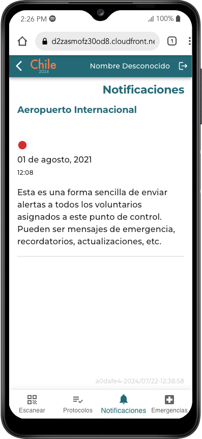

-   La sección de Emergencia permite al voluntario consultar información sobre hospitales, clínicas, farmacias, etc. cercanos a la ubicación del punto de control.

En caso de surgir una emergencia con un delegado, también podrá reportar detalles de la misma escaneando el código QR del delegado y registrando un mensaje al comité de hospitalidad

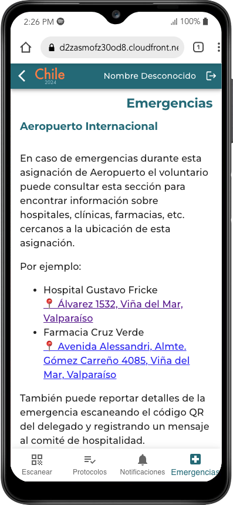
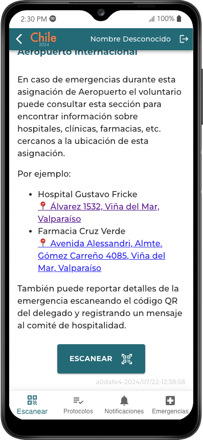
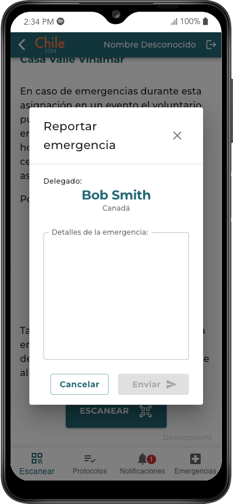

## Caso 2: Punto de control con chequeo de equipaje

-   En este tipo de puntos de control, cada delegado y sus respectivos equipajes se encuentran con un QR registrado en el sistema. Esto permitirá simplemente escanear cada QR y saber de forma muy rápida y sencilla si hay algún delegado o equipaje que no se ha presentado

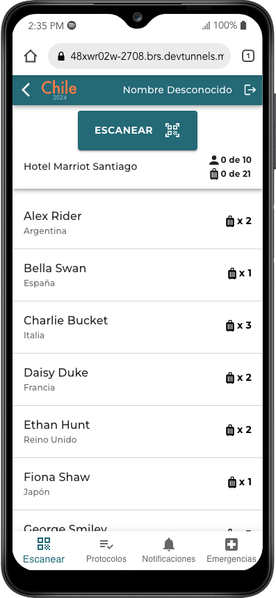
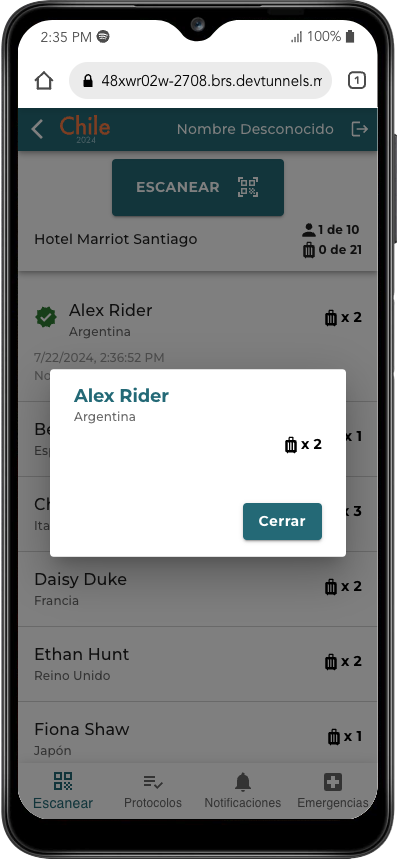
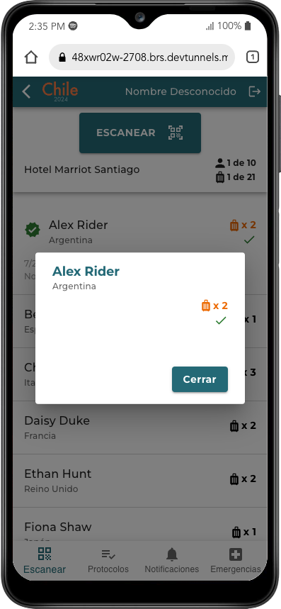
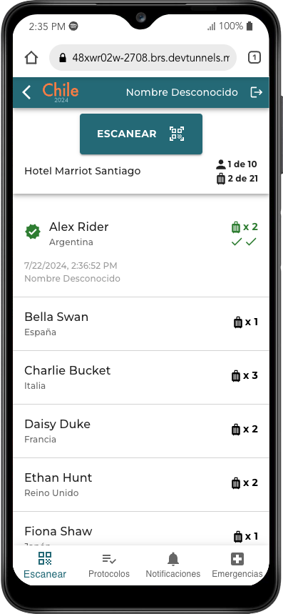

## Caso 3: Punto de control

-   En este tipo de puntos de control, cada delegado se encuentra con un QR registrado en el sistema. Esto permitirá simplemente escanear cada QR y saber de forma muy rápida y sencilla si hay algún delegado que no se ha presentado

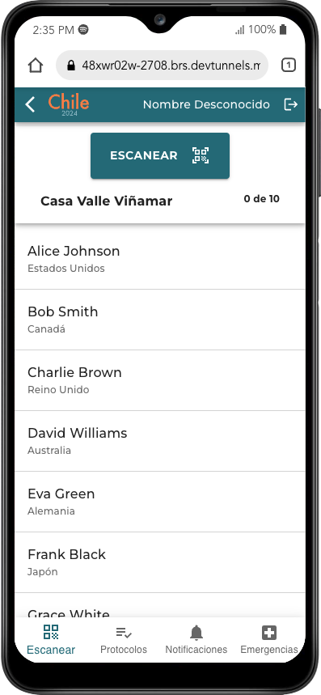
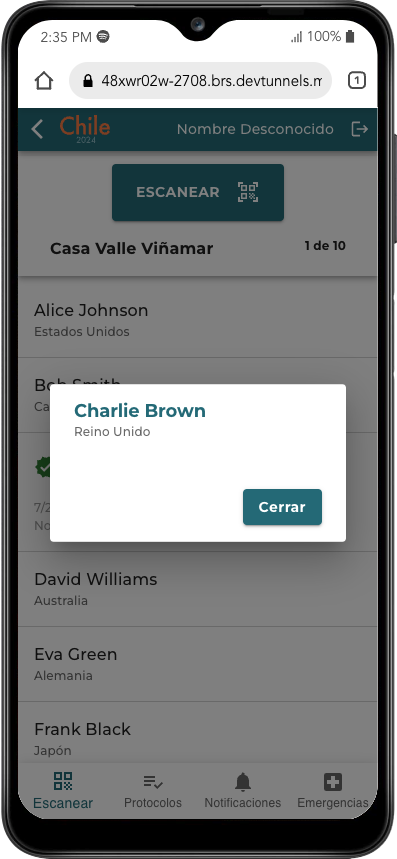
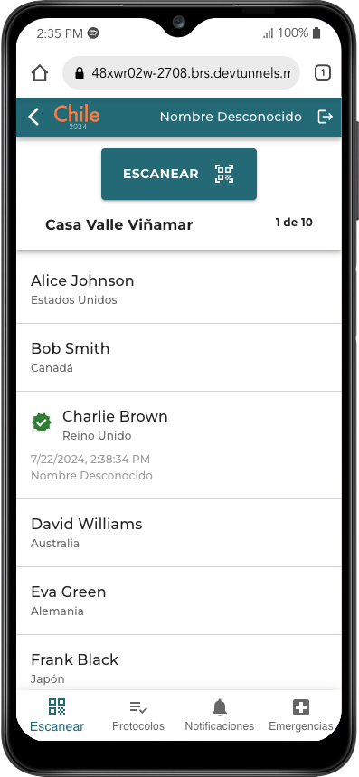


# DEMO

[Aplicación](https://d2zasmofz30od8.cloudfront.net/)

[Generador de QR](https://d2zasmofz30od8.cloudfront.net/generator)

[Códigos QR de ejemplo para casos de uso 2](https://d2zasmofz30od8.cloudfront.net/demo-luggage) (Abrir la aplicación y seleccionar el siguiente punto de control: Hotel Marriott Santiago)

[Códigos QR de ejemplo para casos de uso 3](https://d2zasmofz30od8.cloudfront.net/demo) (Abrir la aplicación y seleccionar el siguiente punto de control: Casa Valle Viñamar)

# Consideraciones técnicas

### Tipos

```typescript
/*
'enrollment': punto de control en el cual se asignan códigos QR a los delegados y a sus equipajes. Por ejemplo: Aeropuerto
'chech-luggage': punto de control en donde se desea registrar la presencia de delegados con equipajes: Por ejemplo: Antes de abordar un bus mientras lleva equipaje
'normal': punto de control en donde se desea registrar la presencia de delegados. Por ejemplo: a la entrada o salida de un evento
*/
type ControlPointType = "enrollment" | "check-luggage" | "normal";

// qr: Valor del código QR
// at: Fecha/Hora del registro
// by: Nombre del voluntario que escaneó el código QR
interface ILog {
    qr: string;
    at?: string;
    by?: string;
}

// id: identificador único para el punto de control. Será utilizado en otras operaciones. Se recomienda que sea un guid
// nombre: es el nombre visible del punto de control
// address: dirección del punto de control
// location: coordenadas gps del punto de control
// type: tipo de punto de control (enrollment, check-luggage o normal)
interface IControlPoint {
    id: string;
    name: string;
    address: string;
    location: {
        lat: number;
        lon: number;
    };
    type: ControlPointType;
}

// id: identificador único para la notificación. Se recomienda que sea un guid
// created_at: Fecha/hora en que se creó la notificación en el backoffice
// subject: títulod de la notificación
// message: cuerpo de la notificación
interface INotification {
    id: string;
    created_at: string;
    subject: string;
    message: string;
}

// id: identificador único para el delegado. Se recomienda que sea un guid
// nombre: nombre completo del delagado
// countryCode: Código de dos caracteres del país de procedencia
// airline: Opcional. Nombre de la aerolinea en que llegará el delegado. Esta información es mostrada cuando el punto de control es enrollment
// flight: Opcional. Número de vuelo en que llegará el delegado. Esta información es mostrada cuando el punto de control es enrollment
// arrival: Opcional. Hora en que llegará el delegado. Esta información es mostrada cuando el punto de control es enrollment
// accomodation: Opcional. Nombre del hotel en que alojará el delegado. Esta información es mostrada cuando el punto de control es enrollment
// enrolled: Opcional. Es llenado cuando el delegado es enrolado con un qr por un voluntario
// luggage: Opcional. Array con la información de enrolamiento de cada equipaje del delegado. Es llenado cuando un voluntario asocia un qr a cada equipaje del delegado
interface IDelegate {
    id: string;
    name: string;
    countryCode: string;
    airline?: string;
    flight?: string;
    arrival?: string;
    accommodation?: string;
    enrolled?: ILog;
    luggage?: ILog[];
}
```

# Endpoints REST

## Autenticación

#### POST /auth/login

-   **Payload:**
    ```json
    {
        "email": "string",
        "password": "string"
    }
    ```
-   **Response:**
    ```json
    {
        "token": "string",
        "role": "string",
        "volunteer_profile": {
            "name": "string"
        }
    }
    ```
    -   **Ejemplo:**
    ```json
    {
        "token": "eyJhbGciOiJIUzI1NiIsInR5cCI6IkpXVCJ9...",
        "role": "operator",
        "volunteer_profile": {
            "name": "Pedro Pérez"
        }
    }
    ```

Todos los endpoints a continuación están restringidos a usuarios registrados y autenticados. El token de autenticación es enviado en el header de cada request.

## Puntos de Control

### GET `/control_points`

Retorna los puntos de control en los que el voluntario ha sido asignado en la fecha actual.

-   **Response:** `IControlPoint[]`
-   **Ejemplo:**
    ```json
    [
        {
            "id": "5390efa3-c9e2-47e1-a74f-3a163021f71b",
            "name": "Aeropuerto Internacional",
            "address": "Av. Armando Cortínez Ote. 1704, Pudahuel, Región Metropolitana",
            "location": {
                "lat": -33.39633234816399,
                "lng": -70.79386634466923
            },
            "type": "enrollment"
        }
    ]
    ```

### `GET /control_points/{id}/protocols`

Retorna el texto que se mostrará en la sección de protocolos. Este contenido está asociado al punto de control. Puede ser texto enriquecido que se mostrará apropiadamente en la aplicación.

-   **Response:** `string`

### `GET /control_points/{id}/emergency_info`

Retorna el texto que se mostrará en la sección de emergencias. Este contenido está asociado al punto de control. Puede ser texto enriquecido que se mostrará apropiadamente en la aplicación.

-   **Response:** `string`

### `GET /control_points/{id}/notifications`

Retorna un array con todas las notificaciones asociadas al punto de control. La app se encargará de consultar este endpoint con cierta frecuencia y destacar las notificaciones más recientes.

-   **Response:** `INotification[]`
-   **Ejemplo:**
    ```json
    [
        {
            "id": "notif1",
            "created_at": "2024-07-21T10:00:00Z",
            "subject": "Consideración importante",
            "message": "Sit amet diam diam lorem et sanctus sea dolor erat stet, sit voluptua gubergren dolores ipsum voluptua et aliquyam nonumy."
        }
    ]
    ```

## Delegados

### GET `/delegates`

Retorna un array con los delegados asociados al punto de control `control_point_id`. Inicialmente no contendrá información de enrolamiento del delegado ni del equipaje.

-   **Params:**
    ```json
    {
        "control_point_id": "string"
    }
    ```
-   **Response:** `IDelegate[]`
-   **Ejemplo:** `IDelegate[]`
    ```json
    [
        {
            "id": "60f1749b-1c87-46c9-ae0c-29b3d6f93499",
            "name": "Alice Smith",
            "countryCode": "US",
            "airline": "American Airlines",
            "flight": "AA123",
            "arrival": "2024-07-21T08:00:00Z",
            "accommodation": "Hotel Central"
        }
    ]
    ```

### GET `/delegates`

Retorna la información del delegado dado el su `qr` de enrolamiento

-   **Params:**
    ```json
    {
        "qr": "string"
    }
    ```
-   **Response:** `IDelegate`

### POST `/delegates/{id}/enroll`

Asocia el código `qr` con el delegado `id`

-   **Payload:**
    ```json
    {
        "qr": "string"
    }
    ```
-   **Response:** `IDelegate`
-   **Ejemplo:**
    ```json
    [
        {
            "id": "60f1749b-1c87-46c9-ae0c-29b3d6f93499",
            "name": "Alice Smith",
            "countryCode": "US",
            "flight": "AA123",
            "airline": "American Airlines",
            "arrival": "2024-07-21T08:00:00Z",
            "accommodation": "Hotel Central",
            "enrolled": {
                "qr": "bb241222-30ee-4e34-9ee4-8e594923006b",
                "at": "2024-07-21T08:30:00Z",
                "by": "Pedro Pérez"
            }
        }
    ]
    ```

### POST `/delegates/{id}/register_luggage`

Asocia el código `qr` con un equipaje del delegado `id`

-   **Payload:**
    ```json
    {
        "qr": "string"
    }
    ```
-   **Response:** `IDelegate`
-   **Ejemplo:**
    ```json
    [
        {
            "id": "delegate1",
            "name": "Alice Smith",
            "countryCode": "US",
            "flight": "AA123",
            "airline": "American Airlines",
            "arrival": "2024-07-21T08:00:00Z",
            "accommodation": "Hotel Central",
            "enrolled": {
                "qr": "bb241222-30ee-4e34-9ee4-8e594923006b",
                "at": "2024-07-21T08:30:00Z",
                "by": "Pedro Pérez"
            },
            "luggage": [
                {
                    "qr": "8b370648-8d7a-4178-8823-bbdc5b7d601b",
                    "at": "2024-07-21T08:35:00Z",
                    "by": "Pedro Pérez"
                }
            ]
        }
    ]
    ```

## Registrar delegado en Punto de Control

### POST `/control_points/{id}/log`

Agrega al registro que el código `qr` fue escaneado en el punto de control `id` y guarda el voluntario que lo escaneó y la fecha/hora en que ocurrió. Retorna `true` si fue exitoso.

-   **Payload:**
    ```json
    {
        "qr": "string"
    }
    ```
-   **Response:** `boolean`

## Registrar emergencias en Punto de Control

Registra la eventualidad de un caso de emergencia asociado a un delegado. `qr` es el código de enrolamiento del delegado y `message` es un texto con las observaciones del voluntario de lleva a cabo el registro

### POST `/control_points/{id}/emergency`

-   **Payload:**
    ```json
    {
        "qr": "string",
        "message": "string"
    }
    ```
-   **Response:** `boolean`
